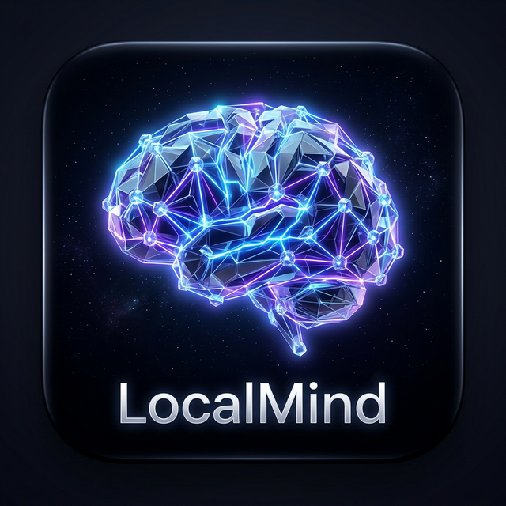

<p align="center">
  
  
  
  
  
  
</p>

<p align="center">
  
  
  
  
  
  
</p>

---

<p align="center">
  
</p>

<h1 align="center">LocalMind — Private On-Device AI Assistant for Android</h1>

<p align="center">
  <strong>Run powerful Large Language Models (LLMs) entirely on your Android phone — no cloud servers, no API keys, no monthly subscriptions, no data collection. 100% offline, 100% private.</strong>
</p>

<p align="center">
  <em>The most advanced open-source on-device AI chatbot for Android. Powered by llama.cpp + GGUF models. Built with Kotlin, Jetpack Compose, and Material 3 design.</em>
</p>

<p align="center">
  <a href="https://github.com/tk85457/LocalMind/releases/latest"><strong>📥 Download Latest APK</strong></a> ·
  <a href="#-getting-started"><strong>🚀 Getting Started</strong></a> ·
  <a href="#-features"><strong>✨ Features</strong></a> ·
  <a href="#-architecture"><strong>🏗️ Architecture</strong></a> ·
  <a href="#-tech-stack"><strong>🛠️ Tech Stack</strong></a>
</p>

---

## 📖 About LocalMind

**LocalMind** is a privacy-first, open-source Android application that brings the power of Large Language Models directly to your mobile device. Unlike cloud-based AI assistants like ChatGPT, Google Gemini, or Claude — LocalMind runs **100% on your phone** using the [llama.cpp](https://github.com/ggerganov/llama.cpp) inference engine with GGUF quantized models.

### Why LocalMind?

| ❌ Cloud AI Problems | ✅ LocalMind Solution |
|---|---|
| Your data sent to remote servers | All data stays on your device |
| Requires internet connection | Works completely offline |
| Monthly subscription fees ($20/mo+) | Free and open-source forever |
| Rate limits and API quotas | Unlimited usage, no restrictions |
| Privacy concerns and data mining | Zero data collection, zero telemetry |
| Vendor lock-in | Open-source, own your AI stack |

---

## ✨ Features

### 🔒 Privacy & Security
- **100% On-Device Inference** — Your conversations never leave your phone
- **Zero Network Requests** — No analytics, no tracking, no cloud dependencies
- **Biometric Authentication** — Lock LocalMind with fingerprint or face unlock
- **Local-First Storage** — All data stored in encrypted Room database

### 💬 Intelligent Chat Interface
- **Material 3 Design** — Beautiful UI following Google's latest design language
- **Markdown Rendering** — Full markdown support with syntax highlighting via Markwon + Prism4j
- **Token-by-Token Streaming** — Real-time response generation for natural conversation flow
- **Chat History** — Persistent conversations with full search functionality
- **Collections** — Organize chats into custom folders and categories

### 🤖 AI Model Management
- **Hugging Face Integration** — Browse, search, and download GGUF models from the world's largest model hub
- **Multiple Model Support** — Switch between different models (Llama, Mistral, Phi, Gemma, Qwen, etc.)
- **Background Downloads** — Download models via WorkManager with progress tracking
- **Model Cards** — View model metadata, parameters, and quantization details
- **Custom Prompt Templates** — Configure system prompts and chat templates per model

### 📁 RAG — Document Chat (Retrieval-Augmented Generation)
- **PDF Upload & Parsing** — Extract text from PDF files via PdfBox Android
- **Context-Aware Responses** — Ask questions about your documents and get accurate answers
- **Local Document Processing** — No documents sent to any server, ever

### ⚙️ Advanced Inference Settings
- **Temperature** — Control response creativity (0.0 = deterministic → 2.0 = creative)
- **Top-P (Nucleus Sampling)** — Fine-tune probability distributions
- **Top-K Sampling** — Limit vocabulary selection per token
- **Repeat Penalty** — Prevent repetitive outputs
- **Stop Words** — Custom stop sequences for response termination
- **BOS/EOS Tokens** — Granular control over generation boundaries
- **GPU Layer Offloading** — Maximize performance with hardware acceleration

### 📊 Performance Monitoring
- **Tokens/Second (t/s)** — Real-time throughput measurement
- **Time To First Token (TTFT)** — Latency tracking and optimization
- **GPU Layer Usage** — Monitor hardware utilization
- **Memory Footprint** — Track RAM consumption during inference

### 🎨 Theming & Localization
- **Material You Dynamic Theming** — Automatic color extraction from wallpaper
- **Dark & Light Modes** — Full theme support with smooth transitions
- **Lottie Animations** — Premium micro-animations throughout the UI
- **Multi-Language Support** — Localized strings with full i18n/l10n framework

---

## 🏗️ Architecture

LocalMind follows **Clean Architecture** with **MVVM** pattern and **Hilt dependency injection**, ensuring separation of concerns, testability, and maintainability.

```
com.localmind.app/
│
├── 📦 core/                       # Foundation Layer
│   ├── di/                        # Hilt modules (Database, Network, Engine)
│   ├── engine/                    # LLM engine lifecycle & orchestration
│   ├── performance/               # Benchmarking & performance profiling
│   ├── rollout/                   # Feature flags & staged rollouts
│   ├── storage/                   # File system & model storage manager
│   └── utils/                     # Shared utilities & extensions
│
├── 📊 data/                       # Data Layer
│   ├── local/                     # Room DAOs, entities, type converters
│   ├── mapper/                    # Entity ↔ Domain model mappers
│   ├── remote/                    # Hugging Face REST API (Retrofit)
│   └── repository/                # Repository implementations
│
├── 🧩 domain/                     # Domain Layer (Pure Kotlin)
│   ├── model/                     # Domain models (Chat, Message, Model, Settings)
│   └── usecase/                   # Business logic use cases
│
├── 🤖 llm/                        # LLM Integration Layer
│   ├── native/                    # JNI bridge to llama.cpp (C++)
│   ├── nativelib/                 # Native library loader & lifecycle
│   └── prompt/                    # Prompt template engine & chat formatters
│
├── 🧭 navigation/                 # Navigation graph (Compose Navigation)
├── 📡 receiver/                   # Broadcast receivers
├── ⚙️ service/                    # Background services (foreground inference)
│
├── 🎨 ui/                         # Presentation Layer
│   ├── components/                # Reusable Compose UI components
│   ├── screens/                   # Screen composables (Chat, Models, Settings)
│   ├── theme/                     # Material 3 theme, colors, typography
│   ├── utils/                     # UI helpers & animation utilities
│   └── viewmodel/                 # ViewModels with StateFlow & SavedStateHandle
│
└── 👷 worker/                     # WorkManager tasks (model downloads)
```

### Native Layer (C++ / NDK)

```
app/src/main/cpp/
├── CMakeLists.txt                 # CMake build configuration
├── jni_bridge.cpp                 # JNI bridge: Kotlin ↔ llama.cpp
└── llama.cpp/                     # llama.cpp submodule (inference engine)
    ├── include/                   # Public headers (llama.h, ggml.h)
    ├── src/                       # Core source files
    └── ggml/                      # GGML tensor library
```

---

## 🛠️ Tech Stack

| Category | Technology | Purpose |
|----------|-----------|---------|
| **Language** | Kotlin 1.9.x | Primary development language |
| **UI Framework** | Jetpack Compose + Material 3 | Declarative, modern UI |
| **Architecture** | Clean Architecture (MVVM) | Separation of concerns |
| **Dependency Injection** | Hilt (Dagger 2) | Compile-time DI |
| **Database** | Room + KSP | Local persistence |
| **Preferences** | DataStore | Key-value storage |
| **Networking** | Retrofit + OkHttp | Hugging Face API |
| **AI Engine** | llama.cpp (JNI/NDK) | On-device LLM inference |
| **Image Loading** | Coil Compose | Async image rendering |
| **Animations** | Lottie Compose | Premium micro-animations |
| **Markdown** | Markwon + Prism4j | Rich text rendering |
| **PDF Parsing** | PdfBox Android | Document text extraction |
| **Background Tasks** | WorkManager | Reliable task scheduling |
| **Build System** | Gradle (Kotlin DSL) + CMake | Multi-platform builds |
| **Native Build** | NDK 26 + CMake 3.22 | C++ compilation for ARM64 |

---

## 🚀 Getting Started

### Prerequisites

| Requirement | Version |
|------------|---------|
| Android Studio | Hedgehog (2023.1.1)+ |
| JDK | 17+ |
| Android SDK | API 34 |
| NDK | 26.1.10909125 |
| CMake | 3.22.1+ |

### Quick Start

```bash
# 1. Clone the repository
git clone https://github.com/tk85457/LocalMind.git
cd LocalMind

# 2. Initialize llama.cpp submodule
git submodule update --init --recursive

# 3. Build debug APK
./gradlew assembleDebug

# 4. Install on connected device
./gradlew installDebug
```

### Pre-Built APK

Download the latest release APK from the [Releases](https://github.com/tk85457/LocalMind/releases/latest) page and install directly on your Android device.

> 📖 See **[BUILD.md](BUILD.md)** for detailed build instructions, signing configuration, and troubleshooting.

---

## 📱 Device Compatibility

| Spec | Requirement |
|------|------------|
| **Minimum Android** | 8.0 Oreo (API 26) |
| **Target Android** | 14 (API 34) |
| **Architecture** | arm64-v8a (64-bit ARM) |
| **RAM (Small Models)** | 4GB+ (1B–3B parameter models) |
| **RAM (Medium Models)** | 6GB+ (7B parameter models) |
| **RAM (Large Models)** | 8GB+ (13B+ parameter models) |
| **Storage** | 2–10GB per model (varies by quantization) |

### Supported Model Formats

- **GGUF** quantized models (Q2_K, Q3_K_S, Q4_0, Q4_K_M, Q5_K_M, Q8_0, F16)
- Compatible families: **Llama 3**, **Mistral**, **Phi-3**, **Gemma**, **Qwen 2**, **Yi**, **StableLM**, and more

---

## 🗺️ Roadmap

- [ ] 🖼️ Multimodal support (image + text models like LLaVA)
- [ ] 🎙️ Voice input with on-device speech-to-text
- [ ] 📤 Chat export (JSON, Markdown, PDF)
- [ ] 🔌 Plugin system for custom tools
- [ ] 🌐 Web UI companion app
- [ ] 📊 Advanced RAG with vector embeddings
- [ ] ⌚ Wear OS companion
- [ ] 🖥️ Desktop version (Windows/macOS/Linux)

---

## 🤝 Contributing

Contributions are welcome! Whether it's bug fixes, new features, documentation, or translations — all contributions are appreciated.

1. **Fork** the repository
2. **Create** your feature branch: `git checkout -b feature/amazing-feature`
3. **Commit** your changes: `git commit -m 'Add amazing feature'`
4. **Push** to the branch: `git push origin feature/amazing-feature`
5. **Open** a Pull Request

---

## 📄 License

This project is licensed under the **MIT License** — see the [LICENSE](LICENSE) file for details.

---

## 🙏 Acknowledgments

| Project | Contribution |
|---------|-------------|
| [llama.cpp](https://github.com/ggerganov/llama.cpp) | C/C++ LLM inference engine |
| [PocketPal AI](https://github.com/a-ghorbani/pocketpal-ai) | Behavioral patterns for model management |
| [Hugging Face](https://huggingface.co/) | Model hosting and discovery platform |
| [Markwon](https://github.com/noties/Markwon) | Android Markdown rendering |
| [Lottie](https://github.com/airbnb/lottie-android) | Animation framework |

---

## ⭐ Star History

If you find LocalMind useful, please consider giving it a ⭐ — it helps others discover the project!

---

<p align="center">
  <strong>🧠 LocalMind — Your AI. Your Data. Your Device.</strong>
</p>
<p align="center">
  Built with ❤️ for privacy-conscious AI enthusiasts
</p>
<p align="center">
  <a href="https://github.com/tk85457/LocalMind/releases/latest">📥 Download</a> ·
  <a href="https://github.com/tk85457/LocalMind/issues">🐛 Report Bug</a> ·
  <a href="https://github.com/tk85457/LocalMind/issues">💡 Request Feature</a>
</p>

---

<!-- SEO Keywords: Android AI App, On-Device LLM, Offline AI Chat, Private AI Assistant, llama.cpp Android, GGUF Models Android, Local AI Chatbot, Open Source AI Android, Run LLM on Phone, Kotlin Jetpack Compose AI, Material 3 AI Chat, Hugging Face Android, Privacy First AI, No Cloud AI, Free AI App Android, RAG Android, Document Chat AI, On-Device Machine Learning, Edge AI Android, LLM Inference Mobile -->
